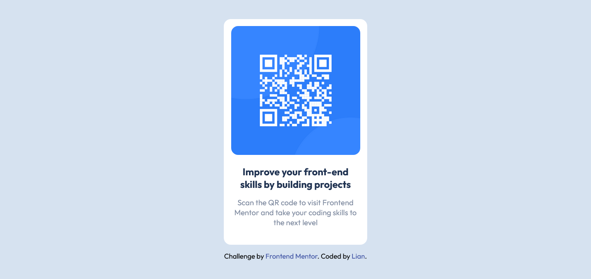
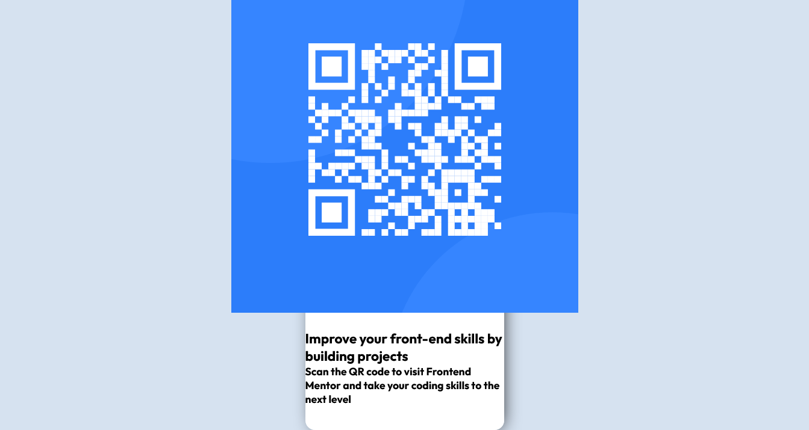
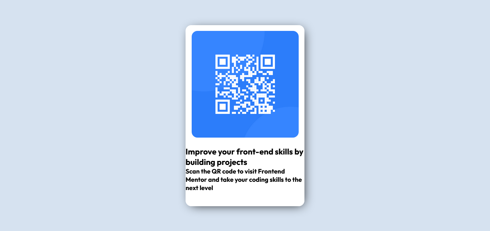
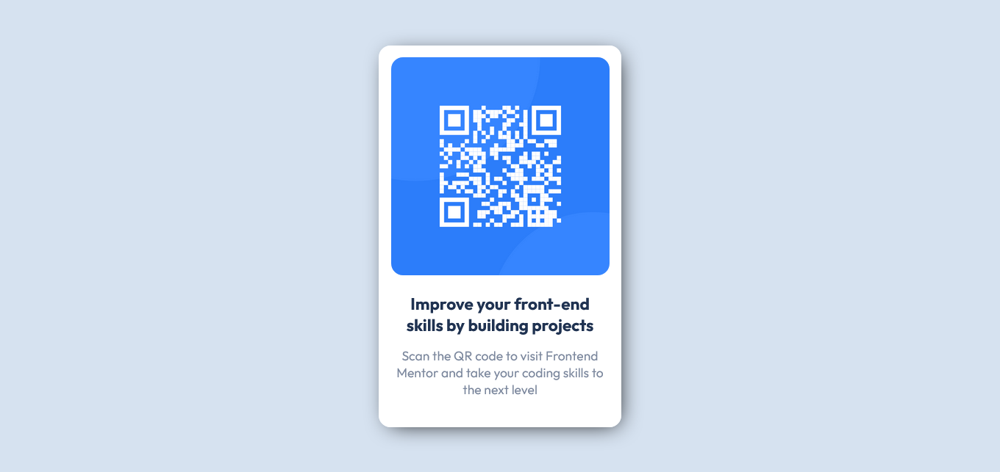

# Frontend Mentor - QR code component solution

This is a solution to the [QR code component challenge on Frontend Mentor](https://www.frontendmentor.io/challenges/qr-code-component-iux_sIO_H). Frontend Mentor challenges help you improve your coding skills by building realistic projects. 

## Table of contents

- [Frontend Mentor - QR code component solution](#frontend-mentor---qr-code-component-solution)
  - [Table of contents](#table-of-contents)
  - [Overview](#overview)
    - [Screenshot](#screenshot)
    - [Links](#links)
  - [My process](#my-process)
    - [Basic Structure](#basic-structure)
    - [CSS Reset and Typegraphy](#css-reset-and-typegraphy)
    - [Body Style](#body-style)
    - [Main](#main)
    - [QR Image](#qr-image)
    - [Info](#info)
    - [Built with](#built-with)
    - [What I learned](#what-i-learned)
    - [Useful resources](#useful-resources)
  - [Author](#author)
  - [Acknowledgments](#acknowledgments)

## Overview

### Screenshot



### Links

- Solution URL: [Read](https://github.com/liandeveloper/qr-code-component-main)
- Live Site URL: [Watch](https://liandeveloper.github.io/qr-code-component-main/)

## My process

### Basic Structure

**HTML :**

```html
<!DOCTYPE html>
<html lang="en">
<head>
  <meta charset="UTF-8">
  <meta name="viewport" content="width=device-width, initial-scale=1.0"> <!-- displays site properly based on user's device -->
  <link rel="icon" type="image/png" sizes="32x32" href="./images/favicon-32x32.png">
  <link rel="stylesheet" href="styles.css">
  <title>Frontend Mentor | QR code component</title>
<body>

</body>
</html>
```

### CSS Reset and Typegraphy

**CSS :**

```css
/* *CSS Reset */
* {
    margin: 0;
    padding: 0;
    box-sizing: border-box;
}
```

Margins and fills will be removed from all elements.

**CSS :**

```css
/* *Typegraphy */
@font-face {
    font-family: 'Outfit';
    src: url('fonts/Outfit-VariableFont_wght.ttf');
}
```

You can use `@font-face` to use text fonts locally. The font type used is `Outfit`.

### Body Style

**CSS :**

```css
/* *Body */
body {
    width: 100%;
    min-height: 100vh;
    display: flex;
    flex-direction: column;
    align-items: center;
    justify-content: center;
    font-size: 15px;
    font-family: 'Outfit', sans-serif;
    background-color: var(--Light-gray);
}
```

The content within the body of the document will be centered. The font size and type will be predefined. And its background color will be ***light gray***.

### Main

**HTML :**

```html
<!-- *Main -->
<main>

  <!-- *QR Image -->
  <section class="img">
    <!-- Image -->
    
  </section>

  <!-- *Info -->
  <section class="info">
    <!-- Title -->
    <h2>Improve your front-end skills by building projects</h2>
    <!-- Description -->
    <h3>Scan the QR code to visit Frontend Mentor and take your coding skills to the next level</h3>
  </section>

</main>
```

Inside `main` will be divided into two sections: `QR Image`, where the image will be and `Info`, the title and description.

**CSS :**

```css
/* *Main */
main {
    width: 90%;
    max-width: 330px;
    display: flex;
    flex-direction: column;
    align-items: center;
    gap: 1.5rem;
    padding: 1rem 0 2.5rem;
    background-color: var(--White);
    box-shadow: 5px 5px 30px -10px #000;
    border-radius: 1rem;
}
```

The `main` tag will have a responsive width that will adapt depending on the device screen until it reaches its predefined width. Its content will be organized in vertical direction with spaces between elements and padding at the top and bottom. Its background color will be ***white*** with curved outline and will have shadow to give it relief.

**Preview :**



### QR Image

**HTML :**

```html
<!-- *QR Image -->
<section class="img">
  <!-- Image -->
  
</section>
```

Inside the `section` tag will go `img` to insert the image.

```css
/* *QR Image */
.img {
    width: 90%;
    overflow: hidden;
    border-radius: 1rem;
}
/* Image */
.img img {
    width: 100%;
    display: block;
}
```

QR Image` will have a width of 90% according to `main`, it will prevent the image from going out of the container and its outline will be curved. `Image` will occupy all the available space.

**Preview :**



### Info

**HTML :**

```html
<!-- *Info -->
<section class="info">
  <!-- Title -->
  <h2>Improve your front-end skills by building projects</h2>
  <!-- Description -->
  <h3>Scan the QR code to visit Frontend Mentor and take your coding skills to the next level</h3>
</section>
```

Inside the second `section` tag there will be two `heading`, `h2` and `h3`.

**CSS :**

```css
/* *Info */
.info {
    width: 90%;
    display: flex;
    flex-direction: column;
    align-items: center;
    gap: 1rem;
    text-align: center;
}
/* Title */
.info h2 {
    color: var(--Dark-blue);
}
/* Description */
.info h3 {
    font-weight: 400;
    color: var(--Grayish-blue);
}
```

The information will be organized and centered in vertical direction with space between `h2` and `h3`. `Title` and `Description` will have predefined text colors, but `Description`, its text thickness will be softer.

**Preview :**



### Built with

- Semantic HTML5 markup
- CSS custom properties
- Flexbox
- Mobile-first workflow

### What I learned

Semantic HTML is very important to order the structure of the document, and Flexbox to organize elements in a simpler way.

### Useful resources

- [Google Fonts](https://fonts.google.com/) - Online library where you can find a lot of text fonts.
- [Visual Studio Code](https://code.visualstudio.com/) - Open source editor.

## Author

- Frontend Mentor - [@liandeveloper](https://www.frontendmentor.io/profile/liandeveloper)
- X - [@lian_dev](https://x.com/lian_dev)

## Acknowledgments

Thank you Frontend Mentor for providing challenges.