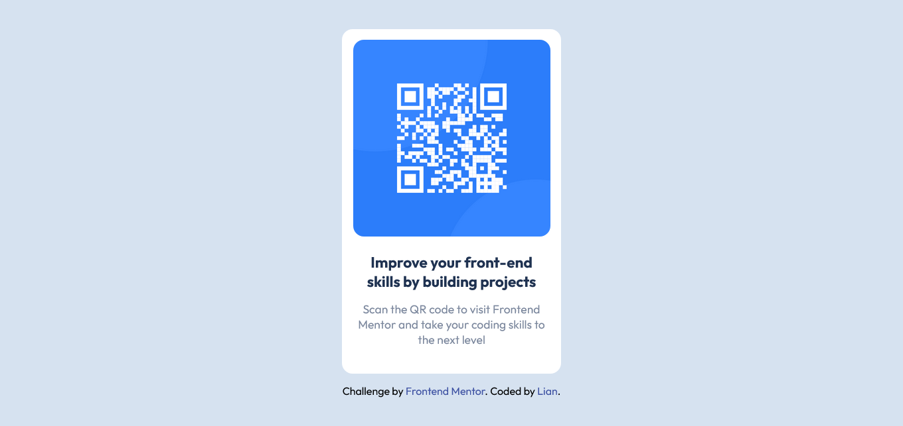
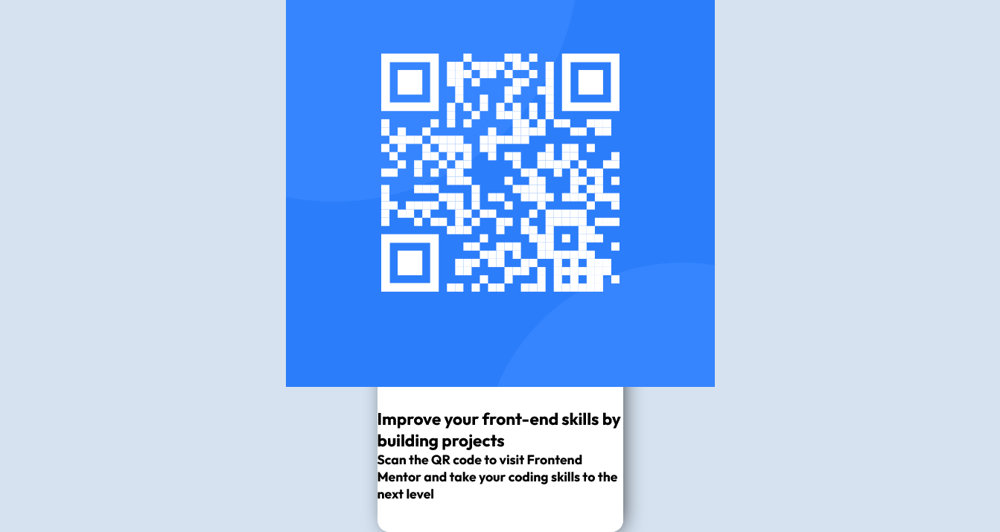
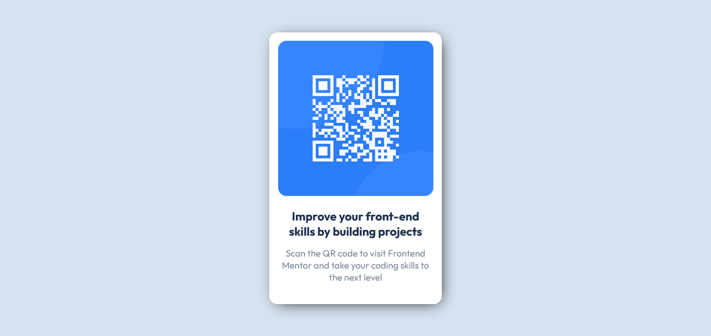

# Frontend Mentor - QR code component solution

Esta es una solución de [QR code component challenge on Frontend Mentor](https://www.frontendmentor.io/challenges/qr-code-component-iux_sIO_H). Los retos de Frontend Mentor te ayudan a mejorar tus habilidades de codificación construyendo proyectos realistas. 

## Tabla de Contenidos

- [Frontend Mentor - QR code component solution](#frontend-mentor---qr-code-component-solution)
  - [Tabla de Contenidos](#tabla-de-contenidos)
  - [Panorama](#panorama)
    - [Captura](#captura)
    - [Enlaces](#enlaces)
  - [Proceso](#proceso)
    - [Estructura Básica](#estructura-básica)
    - [CSS Reset and Typografía](#css-reset-and-typografía)
    - [Estilo de Body](#estilo-de-body)
    - [Main](#main)
    - [QR Image](#qr-image)
    - [Info](#info)
    - [Desarrollado con](#desarrollado-con)
    - [Aprendizaje](#aprendizaje)
    - [Recursos](#recursos)
  - [Author](#author)
  - [Agradecimientos](#agradecimientos)

## Panorama

### Captura



### Enlaces

- Solución: [Lee](https://github.com/liandeveloper/qr-code-component-main)
- Sitio Web: [Mira](https://liandeveloper.github.io/qr-code-component-main/)

## Proceso

### Estructura Básica

**HTML :**

```html
<!DOCTYPE html>
<html lang="en">
<head>
  <meta charset="UTF-8">
  <meta name="viewport" content="width=device-width, initial-scale=1.0"> <!-- displays site properly based on user's device -->
  <link rel="icon" type="image/png" sizes="32x32" href="./images/favicon-32x32.png">
  <link rel="stylesheet" href="styles.css">
  <title>Frontend Mentor | QR code component</title>
<body>

</body>
</html>
```

### CSS Reset and Typografía

**CSS :**

```css
/* *CSS Reset */
* {
    margin: 0;
    padding: 0;
    box-sizing: border-box;
}
```

Se eliminará los márgenes y rellenos de todos los elementos.

**CSS :**

```css
/* *Typegraphy */
@font-face {
    font-family: 'Outfit';
    src: url('fonts/Outfit-VariableFont_wght.ttf');
}
```

Se usa `@font-face` para usar fuentes de textos de manera local. El tipo de fuente usado es `Outfit`.

### Estilo de Body

**CSS :**

```css
/* *Body */
body {
    width: 100%;
    min-height: 100vh;
    display: flex;
    flex-direction: column;
    align-items: center;
    justify-content: center;
    font-size: 15px;
    font-family: 'Outfit', sans-serif;
    background-color: var(--Light-gray);
}
```

El contenido dentro del cuerpo del documento va a estar centrado. El tamaño y tipo de fuente estarán predefinido. Y su color de fondo será ***gris claro***.

### Main

**HTML :**

```html
<!-- *Main -->
<main>

  <!-- *QR Image -->
  <section class="img">
    <!-- Image -->
    
  </section>

  <!-- *Info -->
  <section class="info">
    <!-- Title -->
    <h2>Improve your front-end skills by building projects</h2>
    <!-- Description -->
    <h3>Scan the QR code to visit Frontend Mentor and take your coding skills to the next level</h3>
  </section>

</main>
```

Dentro de `main` se dividirá en dos secciones: `QR Image`, donde estará la imagen e `Info`, el título y la descripción.

**CSS :**

```css
/* *Main */
main {
    width: 90%;
    max-width: 330px;
    display: flex;
    flex-direction: column;
    align-items: center;
    gap: 1.5rem;
    padding: 1rem 0 2.5rem;
    background-color: var(--White);
    box-shadow: 5px 5px 30px -10px #000;
    border-radius: 1rem;
}
```

La etiqueta `main` tendrá un ancho responsivo que se adapatará dependiendo de la pantalla del dispositivo hasta llegar a su ancho predefinido. Su contenido estará organizado en dirección vertical con espacios entre los elementos y relleno superior e inferior. Su color de fondo será ***blanco*** con contorno curvo y tendrá sombra para darle relieve.

**Previsualización :**



### QR Image

**HTML :**

```html
<!-- *QR Image -->
<section class="img">
  <!-- Image -->
  
</section>
```

Dentro de la etiqueta `section` irá `img` para insertar la imágen.

```css
/* *QR Image */
.img {
    width: 90%;
    overflow: hidden;
    border-radius: 1rem;
}
/* Image */
.img img {
    width: 100%;
    display: block;
}
```

`QR Image` tendrá un ancho del 90% de acuerdo a `main`, evitará que la imágen no se salga del contenedor y su contorno será curvo. `Image` ocupará todo el espacio disponible.

**Previsualización :**


### Info

**HTML :**

```html
<!-- *Info -->
<section class="info">
  <!-- Title -->
  <h2>Improve your front-end skills by building projects</h2>
  <!-- Description -->
  <h3>Scan the QR code to visit Frontend Mentor and take your coding skills to the next level</h3>
</section>
```

Dentro de la segunda etiqueta `section` van a ir dos `heading`, `h2` y `h3`.

**CSS :**

```css
/* *Info */
.info {
    width: 90%;
    display: flex;
    flex-direction: column;
    align-items: center;
    gap: 1rem;
    text-align: center;
}
/* Title */
.info h2 {
    color: var(--Dark-blue);
}
/* Description */
.info h3 {
    font-weight: 400;
    color: var(--Grayish-blue);
}
```

La información estará organizada y centrada en dirección vertical con espacio entre `h2` y `h3`. `Title` y `Description` tendrán colores de textos predefinidos, pero `Description`, su grosor de texto será más suave.

**Previsualización :**



### Desarrollado con

- Semantic HTML5 markup
- CSS custom properties
- Flexbox
- Mobile-first workflow

### Aprendizaje

La semántica HTML es muy importante para ordenar la estructura del documento y Flexbox para organizar de manera más simple los elementos.

### Recursos

- [Google Fonts](https://fonts.google.com/) - Biblioteca en línea donde puedes encontrar gran variedad de fuentes de textos.
- [Visual Studio Code](https://code.visualstudio.com/) - Editor de código abierto.

## Author

- Frontend Mentor - [@liandeveloper](https://www.frontendmentor.io/profile/liandeveloper)
- X - [@lian_dev](https://x.com/lian_dev)

## Agradecimientos

Gracias Frontend Mentor por proporcionar retos para que uno pueda superarse en el camino del desarrollo web.