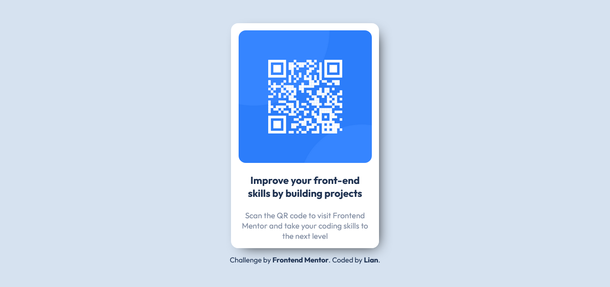
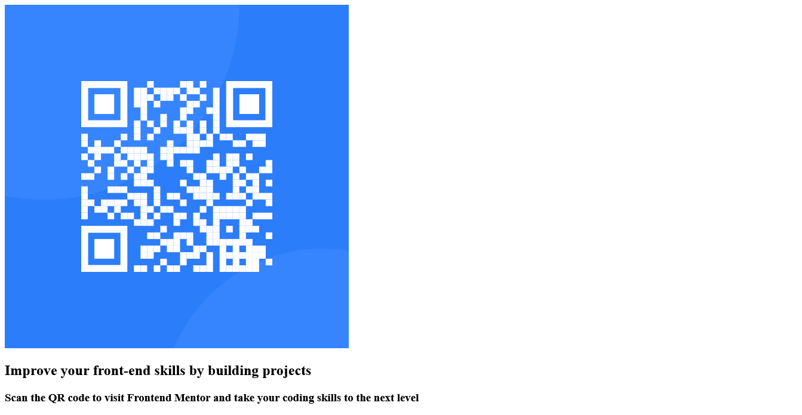

# Frontend Mentor - Solución de QR Code Component

Esto es una solución de [QR code component challenge on Frontend Mentor](https://www.frontendmentor.io/challenges/qr-code-component-iux_sIO_H). Los retos de Frontend Mentor te ayudan a mejorar tus habilidades de codificación construyendo proyectos realistas. 

## Tabla de Contenido

- [Frontend Mentor - Solución de QR Code Component](#frontend-mentor---solución-de-qr-code-component)
  - [Tabla de Contenido](#tabla-de-contenido)
  - [Panorama General](#panorama-general)
    - [Captura de Pantalla](#captura-de-pantalla)
    - [Enlaces](#enlaces)
  - [Proceso](#proceso)
    - [Ajuste del Documento HTML](#ajuste-del-documento-html)
    - [Estructura del documento](#estructura-del-documento)
    - [Colores](#colores)
    - [CSS reset](#css-reset)
    - [Body](#body)
    - [Main](#main)
    - [QR Image](#qr-image)
    - [QR Information](#qr-information)
    - [Desarrollado con](#desarrollado-con)
    - [Aprendizaje](#aprendizaje)
    - [Recursos](#recursos)
  - [Autor](#autor)
  - [Agradecimientos](#agradecimientos)

## Panorama General

Cómo desarrollar una tarjeta de código QR con HTML y CSS.

### Captura de Pantalla



### Enlaces

- Solución URL: [Add solution URL here](https://github.com/liandeveloper/qr-code-component-main)
- Sitio Web URL: [Add live site URL here](https://liandeveloper.github.io/qr-code-component-main/)

## Proceso

### Ajuste del Documento HTML

**Previsualización HTML**:

```html
<!DOCTYPE html>
<html lang="en">
  <head>
    <meta charset="UTF-8">
    <meta name="viewport" content="width=device-width, initial-scale=1.0"> <!-- displays site properly based on user's device -->
    <!-- Favicon -->
    <link rel="icon" type="image/png" sizes="32x32" href="./images/favicon-32x32.png">
    <!-- Styles -->
    <link rel="stylesheet" href="styles.css">
    <!-- Outfit Font -->
    <link rel="preconnect" href="https://fonts.googleapis.com">
    <link rel="preconnect" href="https://fonts.gstatic.com" crossorigin>
    <link href="https://fonts.googleapis.com/css2?family=Outfit:wght@100..900&display=swap" rel="stylesheet">
    <title>Frontend Mentor | QR code component</title>
  </head>
  <body>

  </body>
</html>
```

### Estructura del documento

**Previsualización HTML**:

```html
  <body>
    <!-- *Main -->
    <main class="main">

      <!-- *QR Image -->
      <section class="img">
        <!-- Image -->
        
      </section>

      <!-- *Information -->
      <section class="info">
        <!-- Title -->
        <h2>Improve your front-end skills by building projects</h2>
        <!-- Description -->
        <h3>Scan the QR code to visit Frontend Mentor and take your coding skills to the next level</h3>
      </section>

    </main>
  </body>
```

**Previsualización**:



### Colores

**Previsualización CSS**:

```css
:root {
    /* Colors */
    --White: hsl(0, 0%, 100%);
    --Light-gray: hsl(212, 45%, 89%);
    --Grayish-blue: hsl(220, 15%, 55%);
    --Dark-blue: hsl(218, 44%, 22%);
}
```

> **Nota**: ``:root`` es un selector pseudo-clase que se utiliza para seleccionar el elemento raíz del documento. Al definir variables en ``:root``, te aseguras de que sean accesibles en todo el documento, lo que facilita la gestión y la coherencia de estilos en todo el sitio web.

### CSS reset

**Previsualización CSS**:

```css
* {
    margin: 0;
    padding: 0;
    box-sizing: border-box;
}
```

El elemento `*` eliminará los márgenes y rellenos de los elementos y se ajustará al modelo de caja para facilitar el control del tamaño de los elementos.

### Body

**Previsualización CSS**:

```css
body {
    width: 100%;
    min-height: 100vh;
    display: flex;
    flex-direction: column;
    align-items: center;
    justify-content: center;
    padding: .5rem 0;
    font-family: "Outfit", sans-serif;
    font-weight: 400;
    font-size: 15px;
    background-color: var(--Light-gray);
}
```

El contenenido del elemento `body` estará centrado tanto en dirección vertical como horizontal, aplicará una fuente con tamaño y grosor especifico y un color de fondo.

### Main

**Previsualización CSS**:

```css
/* *Main */
.main {
    width: 90%;
    max-width: 330px;
    display: flex;
    flex-direction: column;
    align-items: center;
    gap: 1.5rem;
    padding: 1rem 0;
    background-color: var(--White);
    box-shadow: 10px 10px 30px -15px #000;
    overflow: hidden;
    border-radius: 1rem;
}
```

El elemento con la clase `.main` tendrá un ancho flexible pero limitado, sus elemento (hijos) estarán alineados en dirección vértical y centrado con espacios entre ellos, también tendrán relleno vertical, un color de fondo, sombra para darle relieve y bordes redondeados, mientras evita desbordamiento del contenido.

### QR Image

**Previsualización HTML**:

```html
<!-- *QR Image -->
<section class="img">
  <!-- Image -->
  
</section>
```

**Previsualización CSS**:

```css
/* *QR Image */
.img {
    width: 90%;
    overflow: hidden;
    border-radius: 1rem;
}
/* Image */
.img img {
    width: 100%;
    display: block;
}
```

El contenedor `.img` tendrá un ancho del 90% respecto a `.main` con bordes redondeados y evitará que el contendio se desborde. La etiqueta `img` (imágen) se ajustará al contenedor como un bloque, lo que eliminará cualquier espacio en blanco.

**Previsualización**:


### QR Information

**Previsualización HTML**:

```html
<!-- *Information -->
<section class="info">
  <!-- Title -->
  <h2>Improve your front-end skills by building projects</h2>
  <!-- Description -->
  <h3>Scan the QR code to visit Frontend Mentor and take your coding skills to the next level</h3>
</section>
```

**Previsualización CSS**:

```css
/* *Information */
.info {
    width: 90%;
    display: flex;
    flex-direction: column;
    align-items: center;
    gap: 1rem;
    text-align: center;
}
/* Title */
.info h2 {
    width: 95%;
    color: var(--Dark-blue);
}
/* Description */
.info h3 {
    width: 100%;
    font-weight: 400;
    color: var(--Grayish-blue);
}
```

El elemento con la clase `.info` tendrá un contenedor flexbox con elementos (hijos) en dirección vértical y centrado con espacios entre ellos. Los elementos `h2` y `h3` tendrán tamaños y colores específicos, pero `h3` su grosor de fuente será de más ligero.

**Previsualización**:


****

### Desarrollado con

- Semantic HTML5 markup
- CSS custom properties
- Mobile-first workflow

### Aprendizaje

Al crear una página web, es fundamental utilizar HTML semántico para estructurar adecuadamente las partes del documento. Además, Flexbox simplifica la tarea de organizar los elementos en la página.

### Recursos

- [Google Fonts](https://fonts.google.com/?preview.layout=grid) - Es una biblioteca gratuita de fuentes web que permite a los desarrolladores integrar tipografías variadas en sus sitios.

- [Visual Studio Code](https://code.visualstudio.com/) - Es un editor de código gratuito y de código abierto desarrollado por Microsoft para programadores y desarrolladores.

## Autor

- Frontend Mentor - [@liandeveloper](https://www.frontendmentor.io/profile/liandeveloper)
- X - [@lian_dev](https://x.com/lian_dev)

## Agradecimientos

Gracias Frontend Mentor por tus retos que ayudan a mejorar la capacidad de desarrollar y diseñar páginas web.
